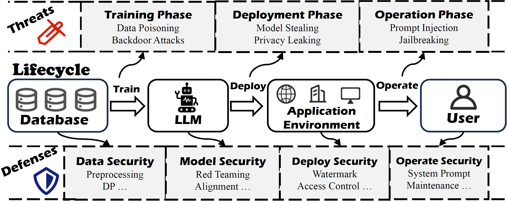

# Awesome LLM Safety Papers :

This repository contains list of papers according to "Mitigating Security Risks in Large Language Models: A Full Lifecycle Perspective".

## Introduction

With the rapid advancement of Large Language Models (LLMs), increasing complexity and widespread deployment of LLMs have exposed them to numerous security threats, necessitating a thorough examination of potential risks and associated mitigation methods. While existing studies focus on specific security aspects, a structured analysis integrating security considerations throughout the LLM lifecycle remains lacking. To address this gap, we propose a lifecycle-based perspective that systematically identifies security threats at each stage, connects them to appropriate defense mechanisms, and examines their broader societal and ethical impacts. Specifically, we first systematically analyze potential security threats across the LLM lifecycle, from training and deployment to operation phases. Building upon this analysis, we propose a security framework that aligns defensive strategies with identified threats at each lifecycle stage, encompassing data protection, model integrity, deployment security, and operational robustness. Furthermore, we investigate how these security challenges contribute to societal and ethical concerns, including privacy risks and potential misuse. Our analysis reveals the intricate relationships between technical vulnerabilities and their societal implications, suggesting directions for future research in LLM security.

    

## Table of Contents

* [Introduction](#introduction)
* [Table of Contents](#table-of-contents)
* [Papers](#papers)
    * [Attacks](#attacks)
        * [Training Phase](#training-phase)
            * [Data Poisoning](#data-poisoning)
            * [Backdoor Attacks](#backdoor-attacks)
            * [Model Stealing](#model-stealing)
            * [Privacy Leaking](#privacy-leaking)
        * [Operation Phase](#operation-phase)
            * [Prompt Injection](#prompt-injection)
            * [Jailbreak](#jailbreak)
    * [Defenses](#defenses)
        * [Data Security](#data-security)
            * [Data Preprocessing](#data-preprocessing)
            * [Differential Privacy](#differential-privacy)
            * [Federated Learning](#federated-learning)
            * [Unlearning](#unlearning)
        * [Model Security](#model-security)
            * [Red-Teaming](#red-teaming)
            * [Alignment](#alignment)
                * [SFT](#sft)
                * [RLHF](#rlhf)
        * [Deployment Security](#deployment-security)
            * [Text Watermarking](#text-watermarking)
            * [Model Encryption](#model-encryption)
            * [Access Control](#access-control)
        * [Operation Security](#operation-security)
            * [Input and Output Safeguards](#input-and-output-safeguards)
            * [System Prompts](#system-prompts)
            * [Continuous Monitoring and Maintenance](#continuous-monitoring-and-maintenance)
    * [Societal Impact and Ethical Considerations](#societal-impact-and-ethical-considerations)
        * [Technological Misuse](#technological-misuse)
        * [Privacy Risks](#privacy-risks)
        * [Copyright Issues](#copyright-issues)
        * [Overreliance](#overreliance)
        * [Employment and Automation](#employment-and-automation)
        * [Inequity Issues](#inequity-issues)

## Papers

### Attacks

#### Training Phase

##### Data poisoning

1. **"Poisoning Web-Scale Training Datasets is Practical"**.

   *Carlini, N et al.* IEEE Symposium on Security and Privacy(SP) 2024 . [[Paper](https://arxiv.org/abs/2302.10149)]

2. "**Data Poisoning for In-context Learning"**

   *He, P et al*. arxiv 2024. [[Paper](https://arxiv.org/abs/2402.02160)]

3. **"Learning to poison large language models during instruction tuning"**

   *Qiang, Y et al*. arxiv 2024. [[Paper](https://arxiv.org/abs/2402.13459)]

4. **“Forcing generative models to degenerate ones: The power of data poisoning attacks”**

   *Jiang, S. et al.* NeurIPS 2023 Workshop on Backdoors in Deep Learning. [[Paper](https://arxiv.org/abs/2312.04748)]

5. **"Fine-tuning aligned language models compromises safety, even when users do not intend to!"**

   *Qi, X. et al.* ICLR 2024. [[Paper](https://arxiv.org/abs/2310.03693)]

6. **"Poisoning language models during instruction tuning"**

   *Wan, A. et al.* ICML 2023. PMLR. [[Paper](https://arxiv.org/abs/2305.00944)]

7. **"On the Exploitability of Instruction Tuning"**

   *Shu, M et al.* NeurIPS 2023 . [[Paper](https://arxiv.org/abs/2306.17194)]

8. **"RLHFPoison: Reward poisoning attack for reinforcement learning with human feedback in large language models"**

   *Wang, J et al.* ACL 2024. [[Paper](https://aclanthology.org/2024.acl-long.140.pdf)]

9. **"Is poisoning a real threat to LLM alignment? Maybe more so than you think"**

*Pathmanathan, P et al.* ICML 2024 Workshop on Models of Human Feedback for AI Alignment . [[Paper](https://openreview.net/pdf?id=QTviVh3VQU)]

##### Backdoor Attacks

1. **“Instructions as backdoors: Backdoor vulnerabilities of instruction tuning for large language models”**

   *Xu, J. et al.* NAACL 2024. [[Paper](https://arxiv.org/abs/2305.14710)]

 2. **“Universal jailbreak backdoors from poisoned human feedback”**

    *Rando, J. et al.* ICLR 2024. [[Paper](https://arxiv.org/abs/2311.14455)]

3. **“Badrag: Identifying vulnerabilities in retrieval augmented generation of large language models”**

   *Xue, J. et al.* arXiv 2024. [[Paper](https://arxiv.org/abs/2406.00083)]

4. **“Weight poisoning attacks on pretrained models”**

   *Kurita, K. et al.* ACL 2020. [[Paper](http://aclanthology.org/2020.acl-main.249.pdf)]

5. **“Backdooring instruction-tuned large language models with virtual prompt injection”**

   *Yan, J. et al.* NAACL 2024. [[Paper](https://aclanthology.org/2024.naacl-long.337.pdf)]

6. **“A backdoor attack against LSTM-based text classification systems”**

   *Dai, J. et al.* IEEE Access 2019. [[Paper](https://ieeexplore.ieee.org/stamp/stamp.jsp?arnumber=8836465)]

7. **“Hidden killer: Invisible textual backdoor attacks with syntactic trigger”**

   *Qi, F. et al.* ACL 2021. [[Paper](https://aclanthology.org/2021.acl-long.37.pdf)]

8. **“Prompt as triggers for backdoor attack: Examining the vulnerability in language models”**

   *Zhao, S. et al.* EMNLP 2023. [[Paper](https://aclanthology.org/2023.emnlp-main.757.pdf)]

9. **“BITE: Textual backdoor attacks with iterative trigger injection”**

   *Yan, J. et al.* ACL 2023. [[Paper](https://aclanthology.org/2023.acl-long.725.pdf)]

10. **“Talk too much: Poisoning large language models under token limit”**

    *He, J. et al.* arXiv 2024. [[Paper](https://arxiv.org/html/2404.14795v3)]

11. **“Training-free lexical backdoor attacks on language models”**

    *Huang, Y. et al.* ACM Web Conference 2023. [[Paper](https://arxiv.org/abs/2302.04116)]

12. **“Badchain: Backdoor chain-of-thought prompting for large language models”**

    *Xiang, Z. et al.* NeurIPS 2023 Workshop. [[Paper](https://openreview.net/pdf?id=S4cYxINzjp)]

13. **“Defending against weight-poisoning backdoor attacks for parameter-efficient fine-tuning”**

    *Zhao, S. et al.* NAACL 2024. [[Paper](https://aclanthology.org/2024.findings-naacl.217.pdf)]

14. **“Measuring impacts of poisoning on model parameters and embeddings for large language models of code”**

    *Hussain, A. et al.* AIware 2024. [[Paper](https://dl.acm.org/doi/10.1145/3664646.3664764)]

15. **“Chain-of-scrutiny: Detecting backdoor attacks for large language models”**

    *Li, X. et al.* arXiv 2024. [[Paper](https://arxiv.org/html/2406.05948v1)]

#### Training Phase

##### Model Stealing

1. **"Practical black-box attacks against machine learning"**  

   *Papernot, N. et al.* ACM Asia CCS 2017. [[Paper](https://arxiv.org/abs/1602.02697)]

2. **"Stealing part of a production language model"**  

   *Carlini, N. et al.* arXiv 2024. [[Paper](https://arxiv.org/abs/2403.06634)]

3. **"Can’t hide behind the API: Stealing black-box commercial embedding models"**  

   *Tamber, M.S. et al.* arXiv 2024. [[Paper](https://arxiv.org/abs/2406.09355)]

4. **"Mondrian: Prompt abstraction attack against large language models for cheaper API pricing"** 

   *Si, W.M. et al.* arXiv 2023. [[Paper](https://arxiv.org/abs/2308.03558)]

5. **"Pleak: Prompt leaking attacks against large language model applications"**  

   *Hui, B. et al.* arXiv 2024. [[Paper](https://arxiv.org/abs/2405.06823)]

6. **"Prompt stealing attacks against large language models"**  

   *Sha, Z. et al.* arXiv 2024. [[Paper](https://arxiv.org/abs/2402.12959)]

7. **"Are you copying my model? Protecting the copyright of large language models for EaaS via backdoor watermark"**  

   *Peng, W. et al.* ACL 2023. [[Paper](https://aclanthology.org/2023.acl-long.423.pdf)]

8. **"Adaptive and robust watermark against model extraction attack"**  

   *Pang, K. et al.* arXiv 2024. [[Paper](https://arxiv.org/abs/2405.02365)]

##### Privacy Leaking

1. **"Large language model watermark stealing with mixed integer programming"**  

   *Zhang, Z. et al.* arXiv 2024. [[Paper](https://arxiv.org/abs/2405.19677)]

2. **"Are large pre-trained language models leaking your personal information?"**  

   *Huang, J. et al.* EMNLP 2022. [[Paper](https://doi.org/10.18653/v1/2022.findings-emnlp.148)]

3. **"Quantifying association capabilities of large language models and its implications on privacy leakage"**  

   *Shao, H. et al.* EACL 2024. [[Paper](https://aclanthology.org/2024.findings-eacl.54.pdf)]

4. **"Beyond memorization: Violating privacy via inference with large language models"**  

   *Staab, R. et al.* ICLR 2024. [[Paper](https://arxiv.org/abs/2310.07298)] [[Source](https://github.com/eth-sri/llmprivacy)]

5. **"Do membership inference attacks work on large language models?"**  

   *Duan, M. et al.* Language Modeling Conference 2024. [[Paper](https://aclanthology.org/2023.findings-acl.719.pdf)]

#### Operation Phase

##### Prompt Injection

1. **"Membership inference attack susceptibility of clinical language models"**  

   *Jagannatha, A. et al.* arXiv 2021. [[Paper](https://arxiv.org/abs/2104.08305)]

2. **"Scalable extraction of training data from (production) language models"**  

   *Nasr, M. et al.* arXiv 2023. [[Paper](https://arxiv.org/abs/2311.17035)]

3. **"Exploiting programmatic behavior of LLMs: Dual-use through standard security attacks"**  

   *Kang, D. et al.* IEEE SPW 2024. [[Paper](https://arxiv.org/abs/2302.05733)]

4. **"Ignore previous prompt: Attack techniques for language models"**  

   *Perez, F. et al.* NeurIPS ML Safety Workshop 2022. [[Paper](https://openreview.net/pdf?id=qiaRo_7Zmug)]

5. **"Jailbreaking ChatGPT via prompt engineering: An empirical study"**  

   *Liu, Y. et al.* arXiv 2023. [[Paper](https://arxiv.org/abs/2305.13860)]

6. **"Ignore this title and hackaprompt: Exposing systemic vulnerabilities of LLMs through a global prompt hacking competition"**  

   *Schulhoff, S. et al.* EMNLP 2023. [[Paper](https://aclanthology.org/2023.emnlp-main.302.pdf)]

7. **"Promptbench: Towards evaluating the robustness of large language models on adversarial prompts"**  

   *Zhu, K. et al.* arXiv 2023. [[Paper](https://arxiv.org/abs/2306.04528)]

8. **"Tensor trust: Interpretable prompt injection attacks from an online game"**  

   *Toyer, S. et al.* ICLR 2024. [[Paper](https://openreview.net/pdf?id=fsW7wJGLBd)]

9. **"Benchmarking and defending against indirect prompt injection attacks on large language models"**  

   *Yi, J. et al.* arXiv 2023. [[Paper](https://arxiv.org/abs/2312.14197)]

##### Jailbreak

1. **"InjecAgent: Benchmarking indirect prompt injections in tool-integrated large language model agents"**  

   *Zhan, Q. et al.* ACL 2024. [[Paper](https://aclanthology.org/2024.findings-acl.624.pdf)]

2. **"Not what you’ve signed up for: Compromising real-world LLM-integrated applications with indirect prompt injection"**  

   *Greshake, K. et al.* ACM AI and Security 2023. [[Paper](https://arxiv.org/abs/2302.12173)]

3. **"Tapi: Towards target-specific and adversarial prompt injection against code LLMs"**  

   *Yang, Y. et al.* arXiv 2024. [[Paper](https://arxiv.org/abs/2407.09164)]

4. **"Jailbroken: How does LLM safety training fail?"**  

   *Wei, A. et al.* NeurIPS 2023. [[Paper](https://openreview.net/forum?id=jA235JGM09)]

5. **"ArtPrompt: ASCII art-based jailbreak attacks against aligned LLMs"**  

   *Jiang, F. et al.* ACL 2024. [[Paper](https://aclanthology.org/2024.acl-long.809.pdf)]

6. **"Deepinception: Hypnotize large language model to be jailbreaker"**  

   *Li, X. et al.* arXiv 2023. [[Paper](https://arxiv.org/abs/2311.03191)] [[Source](https://github.com/tmlr-group/DeepInception)]

7. **"Autodan: Automatic and interpretable adversarial attacks on large language models"**  

   *Zhu, S. et al.* COLM 2024. [[Paper](https://arxiv.org/abs/2310.15140)]

8. **"Universal and transferable adversarial attacks on aligned language models"**  

   *Zou, A. et al.* arXiv 2023. [[Paper](https://arxiv.org/abs/2307.15043)]

### Defenses

#### Data Security

##### Data Preprocessing

1. **"Deduplicating training data makes language models better"**

   *Lee, Katherine, et al.* ACL 2022. [[Paper](https://aclanthology.org/2022.acl-long.577/)] [[Source](https://github.com/google-research/deduplicate-text-datasets)]

2. **"Deduplicating training data mitigates privacy risks in language models"**  

   *Kandpal, Nikhil, Eric Wallace, and Colin Raffel.* ICML 2022. [[Paper](https://arxiv.org/abs/2202.06539)]

3. **"The refinedweb dataset for falcon llm: outperforming curated corpora with web data, and web data only"**  

   *Penedo, Guilherme, et al.* NeurIPS 2023. [[Paper](https://arxiv.org/abs/2305.18674)]

4. **"Privacy- and Utility-Preserving NLP with Anonymized data: A case study of Pseudonymization"**  

   *Yermilov, Oleksandr, Vipul Raheja, and Artem Chernodub.* NeurIPS 2023. [[Paper](https://aclanthology.org/2023.trustnlp-1.20/)] [[Source](https://github.com/olexandryermilov/privacy-preserving-nlp)]

5. **"Large language models are advanced anonymizers"**
   *Staab, Robin, et al.* ICLR 2025. [[Paper](https://arxiv.org/abs/2402.13846)] [Source](https://github.com/robin-staab/anonymizer)

6. **"Beyond memorization: Violating privacy via inference with large language models"**

   *Staab, Robin, et al.* ICLR 2024. [[Paper]((https://arxiv.org/abs/2310.07298))] [Source]([XX](https://github.com/eth-sri/llmprivacy))

##### Differential Privacy

1. **"Calibrating noise to sensitivity in private data analysis"**

   *Dwork, Cynthia, et al.* TCC 2006. [[Paper]((https://link.springer.com/chapter/10.1007/11681878_14))]

2. **"Deep learning with differential privacy"**

   *Abadi, Martin, et al.* CCS 2016. [[Paper](https://dl.acm.org/doi/proceedings/10.1145/2976749)]

3. **"Dp-fp: Differentially private forward propagation for large models"**

   *Jian Du, Haitao Mi* arXiv 2021. [[Paper](https://arxiv.org/abs/2112.14430)]

4. **"Submix: Practical private prediction for large-scale language models"**

   *Ginart, Antonio, et al.* arXiv 2022. [[Paper](https://arxiv.org/abs/2201.00971)]

5. **"Just fine-tune twice: Selective differential privacy for large language models"**

   *Shi, Weiyan, et al.* EMNLP 2022. [[Paper](https://aclanthology.org/2022.emnlp-main.425/)]

6. **"Ew-tune: A framework for privately fine-tuning large language models with differential privacy"**

   *Behnia, Rouzbeh, et al.* IEEE ICDMW 2022. [[Paper](https://arxiv.org/abs/2210.15042)]

7. **"Privacy-preserving in-context learning for large language models."**

   *Wu, Tong, et al.* ICLR 2024. [[Paper](https://arxiv.org/abs/2305.01639)]

8. **"Dpzero: dimension-independent and differentially private zeroth-order optimization"**

   *Zhang, Liang, et al.* NeurIPS. [[Paper](https://arxiv.org/abs/2310.09639)]

9. **"De-amplifying bias from differential privacy in language model fine-tuning"**

   *Srivastava, Sanjari, et al.* arXiv 2024. [[Paper](https://arxiv.org/abs/2402.04489)]

##### Federated Learning

1. **"Integration of Large Language Models and Federated Learning"**

   *Chen, Chaochao, et al.* Patterns 2024. [[Paper](https://arxiv.org/abs/2307.08925)]

2. **"The future of large language model pre-training is federated"**

   *Sani, Lorenzo, et al.* arXiv 2024. [[Paper](https://arxiv.org/abs/2405.10853)]

3. **"Openfedllm: Training large language models on decentralized private data via federated learning"**

   *Ye, Rui, et al.* KDD 2024. [[Paper](https://dl.acm.org/doi/10.1145/3637528.3671582)] [[Source](https://github.com/rui-ye/OpenFedLLM)]

4. **"Shieldgemma: Generative ai content moderation based on gemma"**

   *Zeng, Wenjun, et al.* arXiv 2024. [[Paper](https://arxiv.org/abs/2407.21772)]

5. **"Differentially private low-rank adaptation of large language model using federated learning"**

   *Liu, Xiao-Yang, et al.* arXiv 2023. [[Paper](https://arxiv.org/abs/2312.17493)]

##### Unlearning

1. **"Large language model unlearning"**

   *Yao, Yuanshun, Xiaojun Xu, and Yang Liu.* NeurIPS 2024. [[Paper](https://openreview.net/forum?id=8Dy42ThoNe)] [Source](https://github.com/kevinyaobytedance/llm_unlearn)

2. **"Who’s harry potter? approximate unlearning in llms"**

   *Eldan, Ronen, and Mark Russinovich.* arXiv 2023. [[Paper](https://arxiv.org/abs/2310.02238)]

3. **"Unlearn what you want to forget: Efficient unlearning for llms"**

   *Chen, Jiaao, and Diyi Yang.* EMNLP 2023. [[Paper](https://aclanthology.org/2023.emnlp-main.738/)] [Source](https://github.com/SALT-NLP/Efficient_Unlearning)

4. **"Every language counts: Learn and unlearn in multilingual llms"**

   *Lu, Taiming, and Philipp Koehn.* arXiv 2024. [[Paper](https://arxiv.org/abs/2406.13748)] [Source](https://github.com/TaiMingLu/learn-unlearn)

5. **"Ununlearning: Unlearning is not sufficient for content regulation in advanced generative ai"**

   *Shumailov, Ilia, et al.* arXiv 2024. [[Paper](https://arxiv.org/abs/2407.00106)]

#### Model Security

##### Red-Teaming

1. **"Realtoxicityprompts: Evaluating neural toxic degeneration in language models"**

   *Gehman, Samuel, et al.* EMNLP 2020. [[Paper](https://aclanthology.org/2020.findings-emnlp.301/)]

2. **"Bot-adversarial dialogue for safe conversational agents"**

   *Xu, Jing, et al.* NAACL 2021. [[Paper](https://aclanthology.org/2021.naacl-main.235/)]

3. **"Red teaming language models to reduce harms: Methods, scaling behaviors, and lessons learned"**

   *Ganguli, Deep, et al.* arXiv 2022. [[Paper](https://arxiv.org/abs/2209.07858)] [Source](https://github.com/anthropics/hh-rlhf)

4. **"Red teaming language models with language models"**

   *Perez, Ethan, et al.* EMNLP 2022. [[Paper](https://aclanthology.org/2022.emnlp-main.225/)]

5. **"Gptfuzzer: Red teaming large language models with auto-generated jailbreak prompts"**

   *Yu, Jiahao, et al.* arXiv 2023. [[Paper](https://arxiv.org/abs/2309.10253)] [Source](https://github.com/sherdencooper/GPTFuzz)

6. **"Persistent anti-muslim bias in large language models"**

   *Abid, Abubakar, Maheen Farooqi, and James Zou.* AAAI 2021. [[Paper](https://arxiv.org/abs/2101.05783)]

7. **"Bias and fairness in large language models: A survey"**

   *Gallegos, Isabel O., et al.* CL 2024. [[Paper](https://aclanthology.org/2024.cl-3.8/)]

8. **"Attack prompt generation for red teaming and defending large language models"**

   *Deng, Boyi, et al.* EMNLP 2023. [[Paper]([XX](https://aclanthology.org/2023.findings-emnlp.143/))]

9. **"MART: Improving LLM safety with multi-round automatic red-teaming"**

   *Ge, Suyu, et al.* NAACL 2024. [[Paper](https://aclanthology.org/2024.naacl-long.107/)]

10. **"Automated progressive red teaming"**

   *Jiang, Bojian, et al.* COLING 2025. [[Paper](https://aclanthology.org/2025.coling-main.260/)]

11. **"Unveiling safety vulnerabilities of large language models"**

   *Kour, George, et al.* GEM 2023. [[Paper]((https://aclanthology.org/2023.gem-1.10/))]

12. **"Socialstigmaqa: A benchmark to uncover stigma amplification in generative language models"**

   *Nagireddy, Manish, et al.* AAAI 2024. [[Paper](https://arxiv.org/abs/2312.07492)]

13. **"Truthfulqa: Measuring how models mimic human falsehoods"**

   *Lin, Stephanie, Jacob Hilton, and Owain Evans.* ACL 2022. [[Paper](https://aclanthology.org/2022.acl-long.229/)] [Source](https://github.com/sylinrl/TruthfulQA)

14. **"Curiosity-driven red-teaming for large language models"**

   *Hong, Zhang-Wei, et al.* ICLR 2024. [[Paper](https://arxiv.org/abs/2402.19464)] [Source](https://github.com/Improbable-AI/curiosity_redteam)

##### Alignment

###### SFT

1. **"Self-instruct: Aligning language models with self-generated instructions"**

   *Wang, Yizhong, et al.* ACL 2023. [[Paper](https://aclanthology.org/2023.acl-long.754/)] [Source](https://github.com/yizhongw/self-instruct)

2. **"Enhancing chat language models by scaling high-quality instructional conversations"**

   *Ding, Ning, et al.* EMNLP 2023. [[Paper](https://aclanthology.org/2023.emnlp-main.183/)]

3. **"Baize: An open-source chat model with parameter-efficient tuning on selfchat data"**

   *Xu, Canwen, et al.* EMNLP 2023. [[Paper](https://aclanthology.org/2023.emnlp-main.385/)] [Source](https://github.com/project-baize/baize-chatbot)

4. **"Magpie: Alignment data synthesis from scratch by prompting aligned llms with nothing"**

   *Xu, Zhangchen, et al.* ICLR 2025. [[Paper](https://arxiv.org/abs/2406.08464)] [Source](https://github.com/magpie-align/magpie)

###### RLHF

1. **"Training language models to follow instructions with human feedback"**

   *Ouyang, Long, et al.* NeurIPS 2022. [[Paper](https://arxiv.org/abs/2203.02155)]

2. **"Training a helpful and harmless assistant with reinforcement learning from human feedback"**

   *Bai, Yuntao, et al.* arXiv 2022. [[Paper](https://arxiv.org/abs/2204.05862)] [Source](https://github.com/anthropics/hh-rlhf)

3. **"Llama 2: Open foundation and fine-tuned chat models"**

   *Touvron, Hugo, et al.* arXiv 2023. [[Paper]((https://arxiv.org/abs/2307.09288))] [Source](https://github.com/meta-llama/llama)

4. **"Safe rlhf: Safe reinforcement learning from human feedback"**

   *Dai, Josef, et al.* ICLR 2024. [[Paper](https://arxiv.org/abs/2310.12773)] [Source](https://github.com/PKU-Alignment/safe-rlhf)

5. **"Direct preference optimization: Your language model is secretly a reward model"**

   *Rafailov, Rafael, et al.* NeurIPS 2024. [[Paper](https://arxiv.org/abs/2305.18290)] [Source](https://github.com/eric-mitchell/direct-preference-optimization)

6. **"Smaug: Fixing failure modes of preference optimisation with dpo-positive"**

   *Pal, Arka, et al.* arXiv 2024. [[Paper](https://arxiv.org/abs/2402.13228)] [Source](https://github.com/abacusai/smaug)

7. **"KTO: Model alignment as prospect theoretic optimization"**

   *Ethayarajh, Kawin, et al.* ICML 2024. [[Paper](https://arxiv.org/abs/2402.01306)] [Source](https://github.com/ContextualAI/HALOs)

8. **"A general theoretical paradigm to understand learning from human preferences"**

   *Azar, Mohammad Gheshlaghi, et al.* ICAIS 2024. [[Paper](https://arxiv.org/abs/2310.12036)]

9. **"Simpo: Simple preference optimization with a reference-free reward"**

   *Meng, Yu, Mengzhou Xia, and Danqi Chen.* NeurIPS 2024. [[Paper](https://arxiv.org/abs/2405.14734)] [Source](https://github.com/princeton-nlp/SimPO)

10. **"Constitutional ai: Harmlessness from ai feedback"**

   *Bai, Yuntao, et al.* arXiv 2022. [[Paper](https://arxiv.org/abs/2212.08073)]

11. **"RLAIF vs. RLHF: Scaling Reinforcement Learning from Human Feedback with AI Feedback"**

   *Lee, Harrison, et al.* ICML 2024. [[Paper](https://arxiv.org/abs/2309.00267)]

12. **"Self-rewarding language models"**

   *Yuan, Weizhe, et al.* arXiv 2024. [[Paper](https://arxiv.org/abs/2401.10020)]

13. **"Raft: Reward ranked finetuning for generative foundation model alignment"**

   *Dong, Hanze, et al.* TMLR. [[Paper](https://arxiv.org/abs/2304.06767)]

14. **"Preference ranking optimization for human alignment"**

   *Song, Feifan, et al.* AAAI 2024. [[Paper](https://arxiv.org/abs/2306.17492)]

15. **"Slic-hf: Sequence likelihood calibration with human feedback"**

   *Zhao, Yao, et al.* arXiv 2023. [[Paper](https://arxiv.org/abs/2305.10425)] 

16. **"Self-play finetuning converts weak language models to strong language models"**

   *Chen, Zixiang, et al.* ICML 2024. [[Paper](https://arxiv.org/abs/2401.01335)] [Source](https://github.com/uclaml/SPIN)

17. **"RRHF: Rank responses to align language models with human feedback"**

   *Yuan, Zheng, et al.* NeurIPS 2023. [[Paper](https://arxiv.org/abs/2304.05302)] [Source](https://github.com/GanjinZero/RRHF)

#### Deployment Security

##### Text Watermarking

1. **"A watermark for large language models"**

   *Kirchenbauer, John, et al.* ICMAL 2023. [[Paper](https://arxiv.org/abs/2301.10226)] [Source](https://github.com/jwkirchenbauer/lm-watermarking)

2. **"Semstamp: A semantic watermark with paraphrastic robustness for text generation"**

   *Hou, Abe Bohan, et al.* NAACL 2024. [[Paper](https://aclanthology.org/2024.naacl-long.226/)]

3. **"Double-i watermark: Protecting model copyright for llm fine-tuning"**

   *Li, Shen, et al.* arXiv 2024. [[Paper](https://arxiv.org/abs/2402.14883)]

4. **"Learning to watermark llm-generated text via reinforcement learning"**

   *Xu, Xiaojun, Yuanshun Yao, and Yang Liu.* arXiv 2024. [[Paper](https://arxiv.org/abs/2403.10553)] [Source](https://github.com/xiaojunxu/learning-to-watermark-llm)

##### Model Encryption

1. **"Towards Encrypted Large Language Models with FHE"**

   *Jordan Frery* [[Paper](https://huggingface.co/blog/encrypted-llm)]

2. **"MPCFORMER: FAST, PERFORMANT AND PRIVATE TRANSFORMER INFERENCE WITH MPC"**

   *Li, Dacheng, et al.* ICLR 2023. [[Paper](https://arxiv.org/abs/2211.01452)] [Source](https://github.com/DachengLi1/MPCFormer)

##### Access Control

1. **"Role-based access control"**

   *RS Sandhu* Advances in computers. Vol. 46. Elsevier. [[Paper](https://www.sciencedirect.com/science/article/abs/pii/S0065245808602065)]

2. **"Guide to attribute based access control (abac) definition and considerations (draft)"**

   *Hu, Vincent C., et al.* NIST special publication. [[Paper](https://citeseerx.ist.psu.edu/document?repid=rep1&type=pdf&doi=cab698a5b0949aa7acd0858b55352c5df0a2c2fb)]

3. **"An efficient fine grained access control scheme based on attributes for enterprise class applications."**

   *Santanu Chatterjee, et al.* ICSPCT 2014. [[Paper]((https://ieeexplore.ieee.org/document/6884907))]

#### Operation Security

##### Input and Output Safeguards

1. **"New rule-based phishing detection method"**  

   *Moghimi, M. et al.* Expert Systems with Applications 2016. [[Paper](https://www.sciencedirect.com/science/article/pii/S0957417416000385)]

2. **"Tuw-inf at GermEval 2021: Rule-based and hybrid methods for detecting toxic, engaging, and fact-claiming comments"**  

   *Gémes, K. et al.* GermEval 2021. [[Paper](https://aclanthology.org/2021.germeval-1.10.pdf)]

3. **"Llama guard: LLM-based input-output safeguard for human-AI conversations"**  

   *Inan, H. et al.* arXiv 2023. [[Paper](https://arxiv.org/abs/2312.06674)]

4. **"Aegis: Online adaptive AI content safety moderation with ensemble of LLM experts"**  

   *Ghosh, S. et al.* arXiv 2024. [[Paper](https://arxiv.org/abs/2404.05993)]

5. **"Shield-Gemma: Generative AI content moderation based on Gemma"**  

   *Zeng, W. et al.* arXiv 2024. [[Paper](https://arxiv.org/abs/2407.21772)]

6. **"Lora-guard: Parameter-efficient guardrail adaptation for content moderation of large language models"**  

   *Elesedy, H. et al.* arXiv 2024. [[Paper](https://aclanthology.org/2024.emnlp-main.656.pdf)]

##### System Prompts

1. **"Better zero-shot reasoning with role-play prompting"**  

   *Kong, A. et al.* NAACL 2024. [[Paper](https://aclanthology.org/2024.naacl-long.228.pdf)]

2. **"RoleLLM: Benchmarking, eliciting, and enhancing role-playing abilities of large language models"**  

   *Wang, N. et al.* ACL 2024. [[Paper](https://aclanthology.org/2024.findings-acl.878.pdf)]

3. **"Is 'a helpful assistant' the best role for large language models? A systematic evaluation of social roles in system prompts"**  

   *Zheng, M. et al.* arXiv 2023. [[Paper](https://arxiv.org/abs/2311.10054)]

4. **"Jailbreak and guard aligned language models with only few in-context demonstrations"**  

   *Wei, Z. et al.* arXiv 2023. [[Paper](https://arxiv.org/pdf/2310.06387)]

5. **"Can LLMs follow simple rules?"**  

   *Mu, N. et al.* arXiv 2023. [[Paper](https://arxiv.org/abs/2311.04235)]

6. **"On prompt-driven safeguarding for large language models"**  

   *Zheng, C. et al.* ICML 2024. [[Paper](https://dl.acm.org/doi/10.5555/3692070.3694617)]

##### Continuous Monitoring and Maintenance

1. **"AI maintenance: A robustness perspective"**  

   *Chen, P.-Y. & Das, P.* Computer 2023. [[Paper](https://arxiv.org/abs/2301.03052)]

2. **"What Is AI Monitoring and Why Is It Important"**  

   *Fayard, M.* Coralogix 2023. [[Blog Post](https://coralogix.com/blog/ai-monitoring/)]

3. **"Parameter-efficient fine-tuning of large-scale pre-trained language models"**  

   *Ding, N. et al.* Nature Machine Intelligence 2023. [[Paper](https://www.nature.com/articles/s42256-023-00626-4)]

### Societal Impact and Ethical Considerations

#### Technological Misuse

1. **"Large language model lateral spear phishing: A comparative study in large-scale organizational settings"**  

   *Bethany, Mazal, et al.* arXiv 2024. [[Paper](https://arxiv.org/abs/2401.09727)]

2. **"Analysis and prevention of ai-based phishing email attacks"**  

   *Chibuike Samuel Eze and Lior Shamir.* Electronics 2024. [[Paper](https://arxiv.org/abs/2405.05435)]

3. **"All the news that’s fit to fabricate: Ai-generated text as a tool of media misinformation"**  

   *Kreps, Sarah, R. Miles McCain, and Miles Brundage.* Journal of experimental political science 2022. [[Paper](https://www.cambridge.org/core/journals/journal-of-experimental-political-science/article/abs/all-the-news-thats-fit-to-fabricate-aigenerated-text-as-a-tool-of-media-misinformation/40F27F0661B839FA47375F538C19FA59)]

4. **"Fake news in sheep’s clothing: Robust fake news detection against llm-empowered style attacks"**  

   *Wu, Jiaying and Guo, Jiafeng and Hooi, Bryan* KDD 2024. [[Paper]((https://arxiv.org/abs/2310.10830))] [[Source](https://github.com/jiayingwu19/SheepDog)]

5. **""You Gotta be a Doctor, Lin": An Investigation of Name-Based Bias of Large Language Models in Employment Recommendations"**  

   *Nghiem, Huy, et al.* EMNLP 2024. [[Paper](https://arxiv.org/abs/2406.12232)]

6. **"Angry Men, Sad Women: Large Language Models Reflect Gendered Stereotypes in Emotion Attribution"**  

   *Plaza-del-Arco, Flor Miriam, et al.* ACL 2024. [[Paper](https://arxiv.org/abs/2403.03121)]

#### Privacy Risks

1. **"Beyond memorization: Violating privacy via inference with large language models"**  

   *Staab, Robin, et al.* ICLR 2024. [[Paper](https://arxiv.org/abs/2310.07298)]

2. **"Quantifying association capabilities of large language models and its implications on privacy leakage"**  

   *Shao, Hanyin, et al.* EACL 2024 Findings. [[Paper](https://arxiv.org/abs/2305.12707)]

3. **"DecodingTrust: A Comprehensive Assessment of Trustworthiness in GPT Models"**  

   *Wang, Boxin, et al.* NeurIPS 2023. [[Paper](https://arxiv.org/abs/2306.11698)] [[Source](https://github.com/AI-secure/DecodingTrust)]

#### Copyright Issues

1. **"Speak, Memory: An Archaeology of Books Known to ChatGPT/GPT-4"**  

   *Chang, Kent K., et al.* EMNLP 2023. [[Paper](https://arxiv.org/abs/2305.00118)] [[Source](https://github.com/bamman-group/gpt4-books)]

2. **"Beyond fair use: Legal risk evaluation for training llms on copyrighted text"**  

   *Rahman, Noorjahan, and Eduardo Santacana.* ICML Workshop on Generative AI and Law. 2023. [[Paper](https://blog.genlaw.org/CameraReady/57.pdf)]

3. **"A Survey on LLM-Generated Text Detection: Necessity, Methods, and Future Directions"**  

   *Wu, Junchao, et al.* CL 2025. [[Paper](https://arxiv.org/abs/2310.14724)] [[Source](https://github.com/NLP2CT/LLM-generated-Text-Detection)]

4. **"Humanizing machine-generated content: Evading ai-text detection through adversarial attack"**  

   *Zhou, Ying, Ben He, and Le Sun.* LREC-COLING 2024. [[Paper](https://aclanthology.org/2024.lrec-main.739/)]

#### Overreliance

1. **"Multi-Layer Ranking with Large Language Models for News Source Recommendation"**  

   *Zhang, Wenjia, et al.* SIGIR 2024. [[Paper](https://arxiv.org/abs/2406.11745)]

2. **"Answering real-world clinical questions using large language model based systems"**  

   *Low, Yen Sia, et al.* arXiv 2024. [[Paper](https://arxiv.org/abs/2407.00541)]

3. **"To trust or not to trust? an assessment of trust in ai-based systems: Concerns, ethics and contexts"**  

   *Omrani, Nessrine, et al.* Technological Forecasting and Social Change 181 (2022). [[Paper](https://www.sciencedirect.com/science/article/abs/pii/S0040162522002888)]

4. **"Trust in artificial intelligence: A global study"**  

   *Gillespie, Nicole, et al.* The University of Queensland and KPMG Australia 10 (2023). [[Paper](https://www.aiunplugged.io/wp-content/uploads/2023/10/Trust-in-Artificial-Intelligence.pdf)]

5. **"Impact of artificial intelligence on human loss in decision making, laziness and safety in education"**  

   *Ahmad, Sayed Fayaz, et al.* Humanities and Social Sciences Communications 10.1 (2023). [[Paper](https://www.nature.com/articles/s41599-023-01787-8)]

#### Employment and Automation

1. **"Towards a benchmark for causal business process reasoning with llm"**  

   *Fournier, Fabiana, Lior Limonad, and Inna Skarbovsky.* International Conference on Business Process Management 2024. [[Paper](https://arxiv.org/abs/2406.05506)]

2. **"Econagent: large language model-empowered agents for simulating macroeconomic activities"**  

   *Li, Nian, et al.* ACL 2024. [[Paper](https://arxiv.org/abs/2310.10436)]

3. **"The fine line between automation and augmentation in website usability evaluation"**  

   *Esposito, Andrea, Giuseppe Desolda, and Rosa Lanzilotti.* Scientific Reports 2024. [[Paper](https://www.nature.com/articles/s41598-024-59616-0)]

4. **"The blended future of automation and AI: Examining some long-term societal and ethical impact features"**  

   *Khogali, Hisham O., and Samir Mekid.* Technology in Society 2023. [[Paper](https://www.sciencedirect.com/science/article/pii/S0160791X23000374)]

#### Inequity Issues

1. **"The rising costs of training frontier AI models"**  

   *Cottier, Ben, et al.* arXiv 2024. [[Paper](https://arxiv.org/abs/2405.21015)]

2. **"Bridging the digital divide: the impact of technological innovation on income inequality and human interactions"**  

   *Xiao, Anran, et al.* Humanities and Social Sciences Communications 2024. [[Paper](https://www.nature.com/articles/s41599-024-03307-8)]

3. **"The impact of generative artificial intelligence on socioeconomic inequalities and policy making"**  

   *Capraro, Valerio, et al.* PNAS nexus 2024. [[Paper](https://academic.oup.com/pnasnexus/article/3/6/pgae191/7689236)]

4. **"AI and the Future of Government: Unexpected Effects and Critical Challenges"**  

   *Peixoto, Tiago C., Otaviano Canuto, and Luke Jordan.* Policy Center For The New South (2024). [[Paper](https://www.cmacrodev.com/ai-and-the-future-of-government-unexpected-effects-and-critical-challenges/)]
